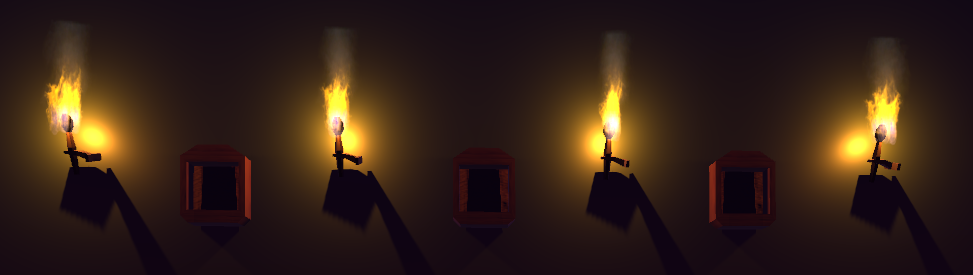
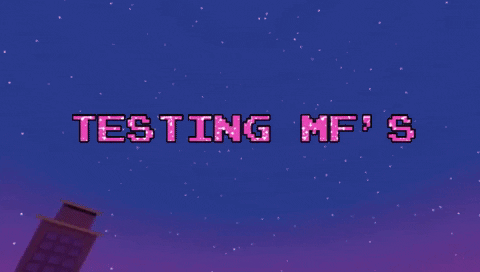

# Luigi's Mansion - Mecánica de succión



Este repositorio contiene el proyecto final de la asignatura **Introducción a la Creación de Videojuegos**. Consiste en un prototipo que simula la mecánica de succión del personaje principal del juego **Luigi’s Mansion**. Dicho prototipo se desarrolló usando `Unity 2021.1.12f1` con la plantilla `Universal Render Pipeline (URP)`. Cabe destacar que se intentó realizar las animaciones desde cero usando el paquete del unity registry [Animation Rigging](https://docs.unity3d.com/Packages/com.unity.animation.rigging@1.0/manual/index.html).

Si desea obtener una copia completa del repositorio ejecute la siguiente línea en una terminal:
```
git clone https://github.com/salitomeyo/char-animation-unity.git
```

## Paquetes principales
<details>
<summary> Ver </summary>

* Animation Rigging (v1.0.3)
* Cinemachine (v2.7.9)
* ProBuilder (v5.0.3)
* TextMeshPro (v3.0.6)
* Visual Effect Graph (v11.0.0)
* ...

</details>

## Cómo jugar
<details>
<summary> Ver </summary>

Para divertirse con este juego hay dos opciones, correrlo directamente en su equipo o acceder a él desde Unity Play para jugarlo en su navegador.

### Descargar release
Instrucciones de descarga y puesta en marcha...

### Unity Play
De click en este [link](https://www.youtube.com/watch?v=gLk8i2zw2jU) y a continuación...

</details>

## Autores
<details>
<summary> Ver </summary>

- [Salome Aristizabal](https://github.com/salitomeyo)
- [Juan Pablo Ciro](https://github.com/JCiroLo)
- [Ana Osorio](https://github.com/ana-os-mo)

</details>


