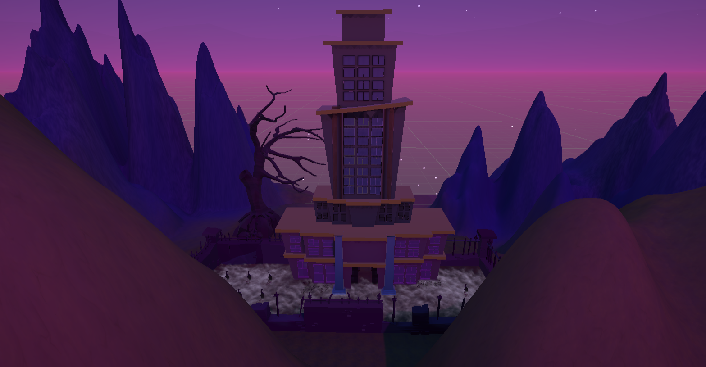
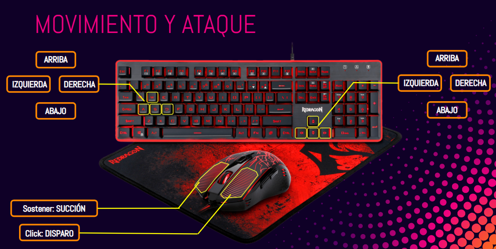

# Luigi's Mansion - Mecánica de succión



Este repositorio contiene el proyecto final de la asignatura **Introducción a la Creación de Videojuegos**. Consiste en un prototipo que simula la mecánica de succión del personaje principal del juego **Luigi’s Mansion**. Dicho prototipo se desarrolló usando `Unity 2021.1.12f1` con la plantilla `Universal Render Pipeline (URP)`. Cabe destacar que se intentó realizar las animaciones desde cero usando el paquete del unity registry [Animation Rigging](https://docs.unity3d.com/Packages/com.unity.animation.rigging@1.0/manual/index.html).

Si desea obtener una copia completa del repositorio ejecute la siguiente línea en una terminal:
```
git clone https://github.com/salitomeyo/char-animation-unity.git
```

## Paquetes principales

<details>
  <summary> Unity Registry </summary>
  
  * Animation Rigging (v1.0.3)
  * Cinemachine (v2.7.9)
  * ProBuilder (v5.0.3)
  * TextMeshPro (v3.0.6)
  * Visual Effect Graph (v11.0.0)

</details>

<details>
  <summary> Asset Store </summary>

  * [Fantasy Tombs & Necropoly Lite](https://assetstore.unity.com/packages/3d/environments/fantasy/fantasy-tombs-necropoly-lite-205971)
  * [Gambler Cat](https://assetstore.unity.com/packages/3d/characters/creatures/gambler-cat-20897)
  * [Lowpoly Medieval Plague Doctor](https://assetstore.unity.com/packages/3d/characters/humanoids/fantasy/lowpoly-medieval-plague-doctor-free-pack-176809)
  * [Low Polу Skeleton](https://assetstore.unity.com/packages/3d/characters/creatures/low-pol-skeleton-188865)
  * [Lowpoly Dungeon Assets](https://assetstore.unity.com/packages/3d/environments/dungeons/lowpoly-dungeon-assets-117330)
  * [Skybox Extended Shader](https://assetstore.unity.com/packages/vfx/shaders/free-skybox-extended-shader-107400)

</details>

## Cómo jugar

Para divertirse con este juego hay dos opciones, correrlo directamente en su equipo o acceder a él desde Unity Play para jugarlo en su navegador.

<details>
  <summary> Descargar release </summary>
  
  Al entrar al repositorio puede ver los releases en la parte derecha de la pantalla. De click en el release más actual (latest) y a continuación descargue el archivo    Luigi.s_Mansion_prototype.zip.
  Descomprima en un folder el archivo descargado y ejecute el Luigi-mansion.exe.
  Para salir del juego use Ctrl+F4.
  
</details>

<details>
  <summary> Unity Play </summary>
  
  De click en este [link](https://www.youtube.com/watch?v=gLk8i2zw2jU) y a continuación...
  
</details>

<details>
  <summary> Controles de juego </summary>
  
  
  
</details>

## Autores

- [Salome Aristizabal](https://github.com/salitomeyo)
- [Juan Pablo Ciro](https://github.com/JCiroLo)
- [Ana Osorio](https://github.com/ana-os-mo)

<p align="center">
  
</p>

